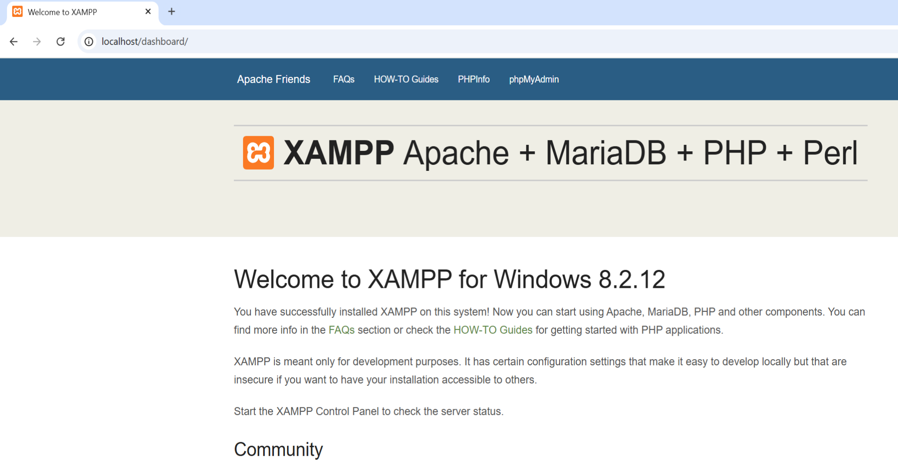
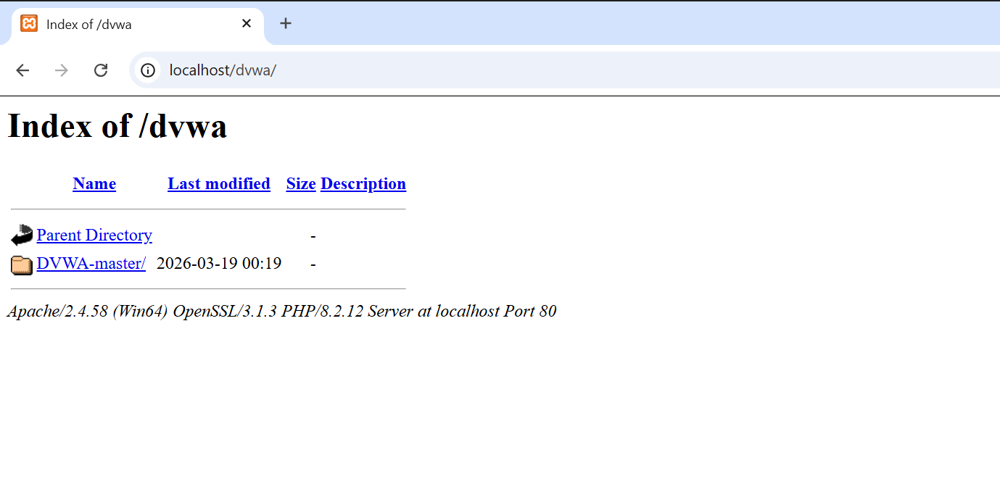
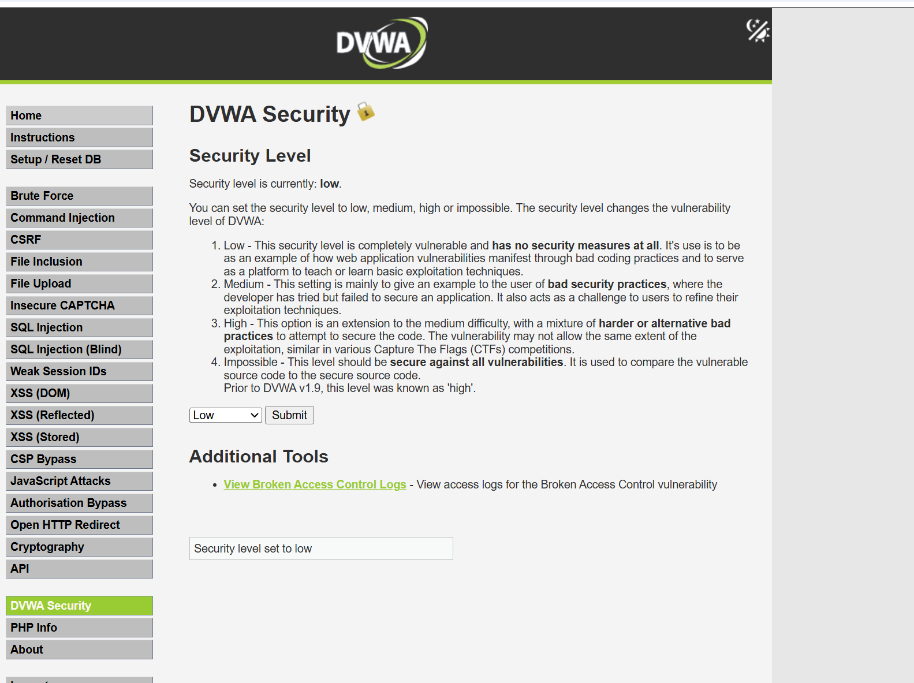
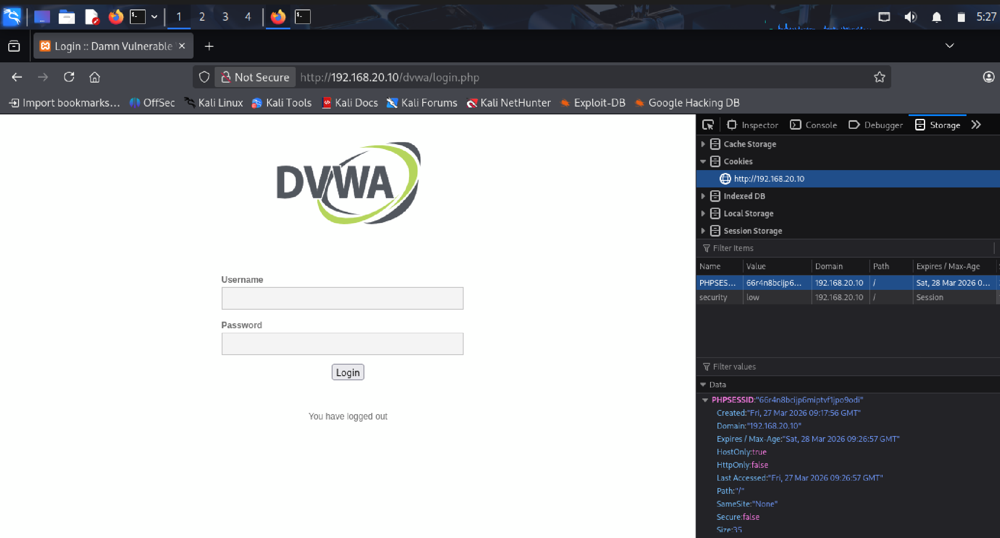
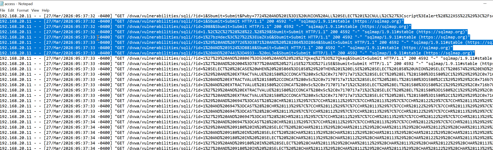
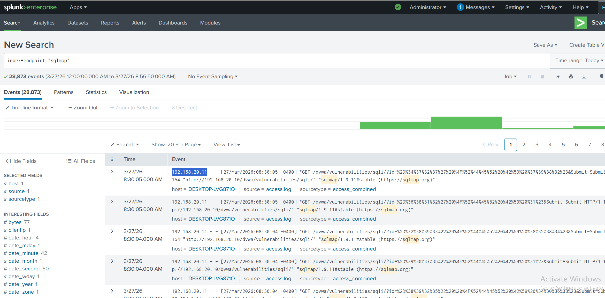
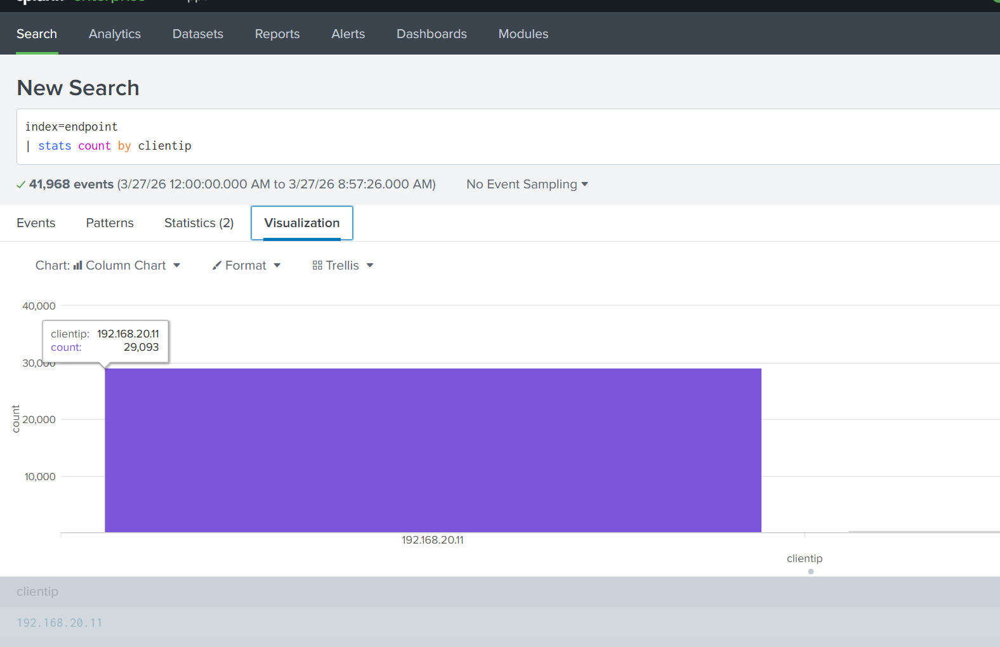
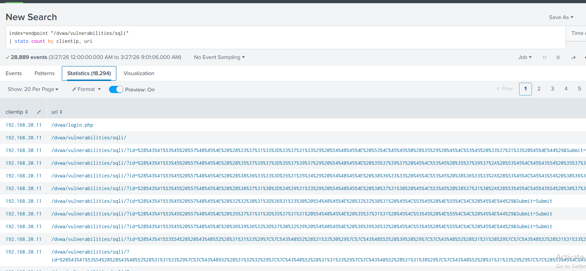
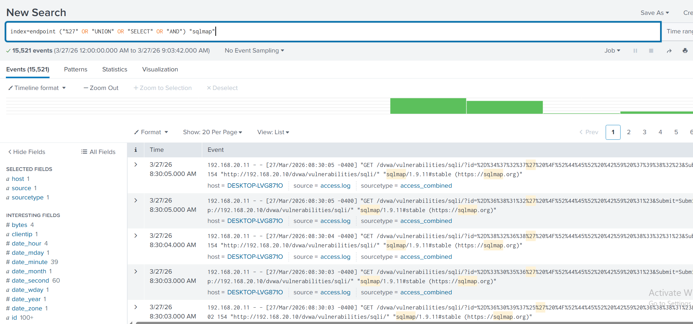

# sql-injection-attack-detection-splunk
Simulated SQL Injection attack on DVWA and detected malicious activity using Splunk SIEM

# SQL Injection Attack Detection using Splunk

## Overview

This project demonstrates a complete attack and detection lifecycle by simulating a SQL Injection attack on a vulnerable web application (DVWA) and analyzing the generated logs using Splunk SIEM.

The objective is to replicate a real-world Security Operations Center (SOC) scenario where an attacker exploits a web vulnerability and the defender detects malicious activity through log analysis.

## Objectives

* Simulate SQL Injection attack on a vulnerable web application
* Generate real attack traffic using sqlmap
* Capture HTTP logs from the target system
* Ingest logs into Splunk
* Detect malicious activity using SPL queries
* Identify attacker IP and suspicious patterns

## Lab Setup

### Attacker Machine

* Kali Linux
* IP Address: 192.168.20.11

### Target Machine

* Windows 10
* DVWA hosted using XAMPP (Apache + MySQL + PHP)
* IP Address: 192.168.20.10

### Network Verification

Connectivity between attacker and target verified using ICMP ping.

## Vulnerable Application Setup

DVWA (Damn Vulnerable Web Application) is used as the target application.

### Security Configuration

DVWA security level is set to LOW to allow exploitation.

## Exploitation Phase

### Manual SQL Injection

A basic SQL Injection payload was used to bypass authentication:

1' OR '1'='1

This resulted in retrieval of multiple user records from the database.

### Automated Attack using sqlmap

sqlmap was used to automate SQL Injection exploitation and generate large-scale attack traffic against the target application.

## Attack Evidence (Log Analysis)

Apache access logs captured multiple SQL Injection payloads generated by sqlmap.

Key observations:

* Repeated requests to vulnerable endpoint
* Encoded SQL payloads
* High frequency of requests from attacker IP

## Detection using Splunk

Logs were ingested into Splunk for analysis.

### Detecting sqlmap Activity

index=endpoint "sqlmap"

### Identifying Attacker IP

index=endpoint | stats count by clientip

### Visualization

A visualization was created to clearly identify the attacker based on request volume.

Key finding:

* IP 192.168.20.11 generated the majority of traffic

## Key Findings

* SQL Injection vulnerability successfully exploited
* Automated attack generated high-volume malicious traffic
* Logs clearly captured attack patterns
* Splunk successfully detected:

  * Attack tool (sqlmap)
  * Suspicious query patterns
  * Attacker IP address
* Demonstrates complete attack → detection workflow

## Conclusion

This project demonstrates a real-world SOC use case where an attacker exploits a web application vulnerability and defenders detect the attack using log analysis.

It highlights the importance of:

* Monitoring web server logs
* Detecting automated attack tools
* Using SIEM solutions for threat detection

## Tools Used

* Kali Linux
* DVWA (Damn Vulnerable Web Application)
* sqlmap
* Apache (XAMPP)
* Splunk Enterprise
* Windows 10

## Future Improvements

* Add alerting in Splunk for real-time detection
* Implement detection rules for SQL keywords
* Correlate with other logs (Sysmon, Windows logs)
* Simulate additional web attacks (XSS, Command Injection)
